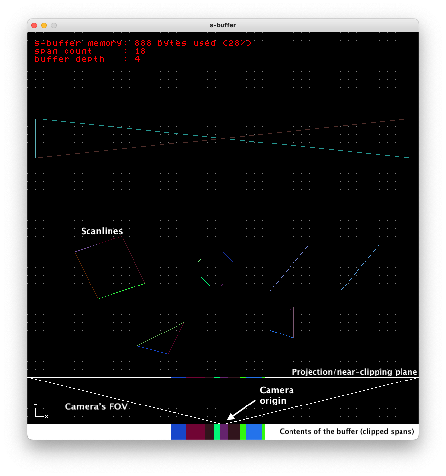
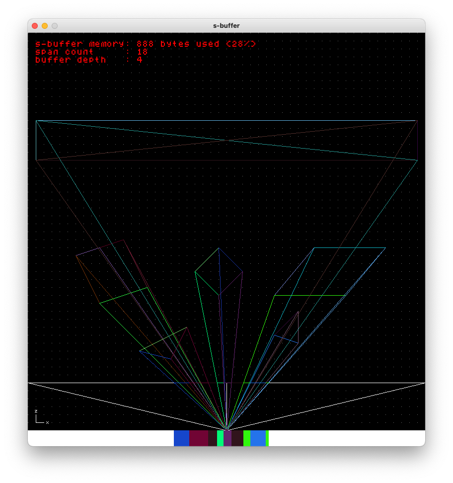

<p align="center">
    </img>
    </img>
    <p align="center" style="font-size: 14px;">
        <em style="font-size: 14px;">
            Hold the <kbd>D</kbd> key on your keyboard to enable projection
            lines.
        </em>
    </p>
</p>

## Requirements

  * `gcc`
  * `make`

You'll need `gcc` and `make` both installed on your system as they're required
to build the demo.

## Setting up

The app depends on [SDL2](https://github.com/libsdl-org/SDL/tree/SDL2), which is
conveniently included as a submodule in the project. To build SDL2 and s-buffer
as dynamic libraries and link them against the application, run the following
command from the project root.

```bash
$ ./demo/build.sh
```

<br>

> ⚠️ *If you're running macOS, you may need to run the following command instead
> ([as is recommended by SDL](https://wiki.libsdl.org/SDL2/Installation#macos)).*
> ```bash
> $ CC=../build-scripts/clang-fat.sh ./demo/build.sh
> ```

<br>

This should give you the executable `sbuffer-demo` that launches the demo app.

```bash
$ ./demo/sbuffer-demo
```

## Overview

Upon launching the demo, you'll be greeted with a blank canvas providing a 2-D
view of the space along the x-z plane. The "triangle" at the bottom represents
the camera's horizontal FOV (or the top part of the view frustum), with the
bottom edge acting as both the near-clipping and projection planes.

As you begin to draw line segments (which actually correspond to individual
scanlines at a given y-coordinate when rasterizing polygons), you'll notice that
they're getting projected onto the near-clipping plane. The projection will also
be reflected in the rectangular section at the very bottom of the canvas to help
visualize the contents of the buffer.

Notice how only those sections of scanlines closer to the camera that are not
obscured by others appear in the projection and are what's actually stored in
the buffer. If a newly added span is obscured by an existing one, it'll be
clipped accordingly before being pushed onto the buffer. Likewise, if a new span
is obscuring an existing one, the existing will be clipped, or discarded
completely. This is the exact problem (i.e., hidden surface removal, or
sometimes more broadly referred to as the visibility problem) that the S-Buffer
(or Z-Buffer for that matter) is used to solve.
